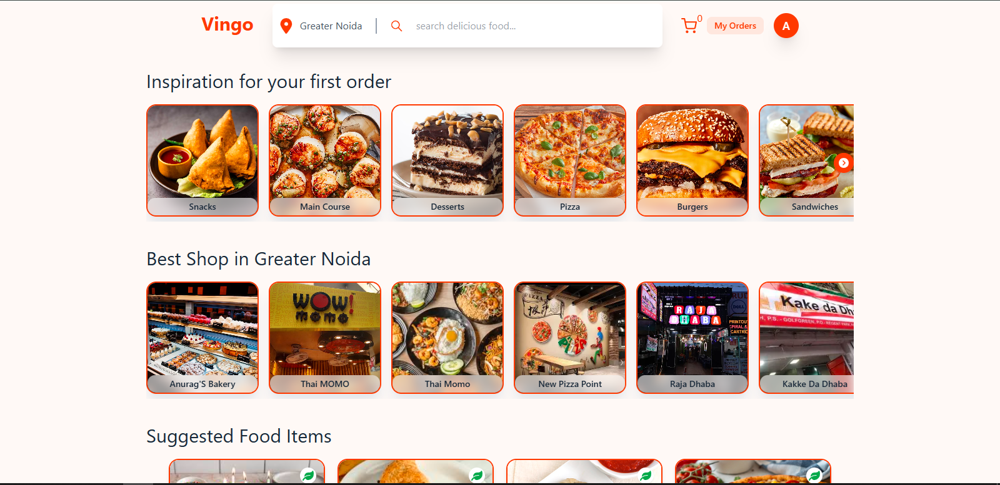
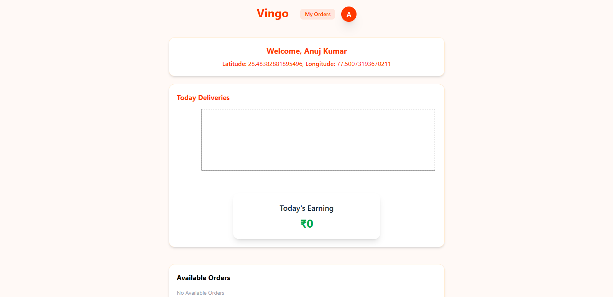

# 🍔 Vingo - Food Delivery Web Application

## 📌 Overview

Vingo is a full-stack **food delivery web application** built using the **MERN stack**. It allows users to browse restaurants, place food orders, track deliveries, and make payments online. The platform also provides dedicated dashboards for **restaurant owners** and **delivery partners** to manage their operations efficiently.

---

## 🚀 Features

### 👤 User Features

* Browse restaurants and food items
* Add food items to cart
* Place orders using **Cash on Delivery** or **Online Payment**
* View current and previous orders
* Track delivery status in real time
* Select delivery location using map integration

### 🏪 Restaurant Owner Features

* Manage restaurant profile
* Add, update, and delete food items
* Receive real-time order notifications
* View and manage customer orders
* Update order status

### 🚚 Delivery Partner Features

* View assigned deliveries
* Track active deliveries
* Mark orders as delivered
* Monitor completed deliveries and earnings

### ⚡ Core Functionalities

* **Socket.io** for real-time communication
* **Razorpay** integration for secure payments
* **Geoapify API** for location-based delivery features
* **Cloudinary** for image uploads
* **Role-based authentication and authorization**

---

## 🛠️ Tech Stack

### Frontend

* React.js
* Redux Toolkit
* Tailwind CSS
* React Leaflet

### Backend

* Node.js
* Express.js
* MongoDB
* Mongoose

### Integrations

* Socket.io
* Razorpay
* Cloudinary
* Geoapify API

---

---

## ⚙️ Installation & Setup

### 1. Clone the repository

```bash id="r89c8g"
git clone https://github.com/anuragverse/vingo-food-delivery-app.git
cd vingo-food-delivery-app
```

### 2. Install dependencies

#### Backend

```bash id="53al5w"
cd backend
npm install
```

#### Frontend

```bash id="uyplqg"
cd frontend
npm install
```

### 3. Setup environment variables

Create `.env` files in both `backend` and `frontend` using the `.env.example` files.

### 4. Run the application

#### Start Backend

```bash id="6h6vtp"
cd backend
npm run dev
```

#### Start Frontend

```bash id="8smqyy"
cd frontend
npm run dev
```

---

## 🌐 Environment Variables

### Backend (`.env`)

```env id="v2wl5h"
PORT=
MONGO_URI=
JWT_SECRET=
CLOUDINARY_CLOUD_NAME=
CLOUDINARY_API_KEY=
CLOUDINARY_API_SECRET=
RAZORPAY_KEY_ID=
RAZORPAY_KEY_SECRET=
CLIENT_URL=
```

### Frontend (`.env`)

```env id="zkv7vx"
VITE_GEOAPIKEY=
VITE_RAZORPAY_KEY_ID=
VITE_SERVER_URL=
```

---

## 📸 Screenshots

### 🏠 User Home Page

Users can browse restaurants, food categories, and popular dishes.



---

### 📦 Current Order Tracking

Users can track their active order and monitor delivery progress.


---

### 🚚 Delivery Partner Dashboard

Delivery partners can view assigned orders, active deliveries, and earnings.



---

### 🏪 Restaurant Owner Dashboard

Restaurant owners can manage their restaurant profile, food items, and orders.


---


## 🤝 Contributing

Contributions are welcome. Feel free to fork the repository and submit a pull request.

